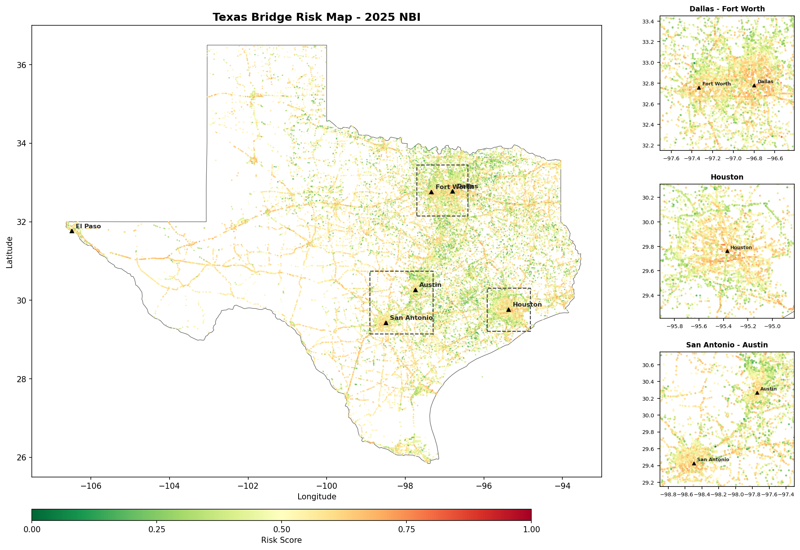
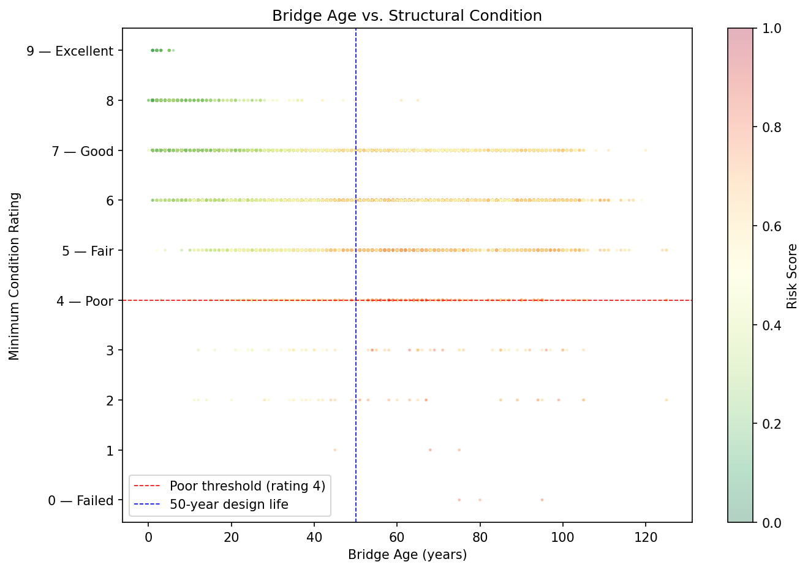
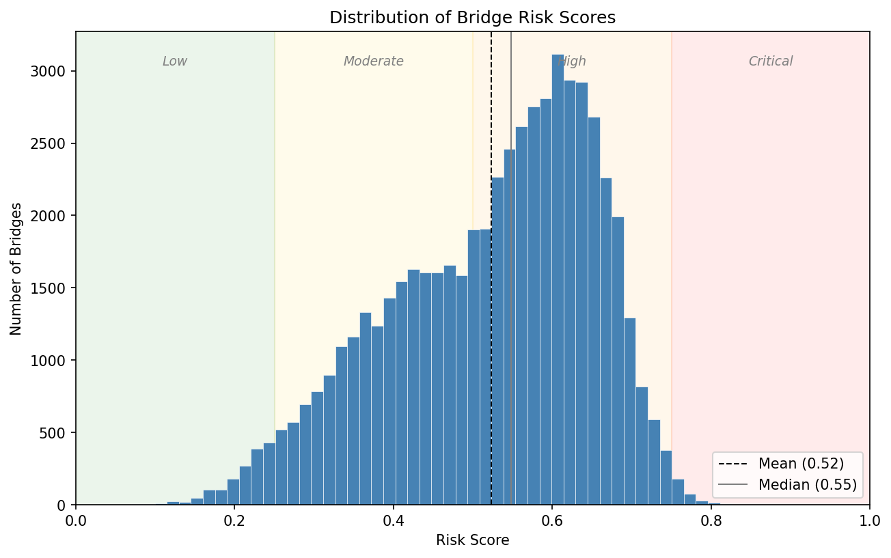
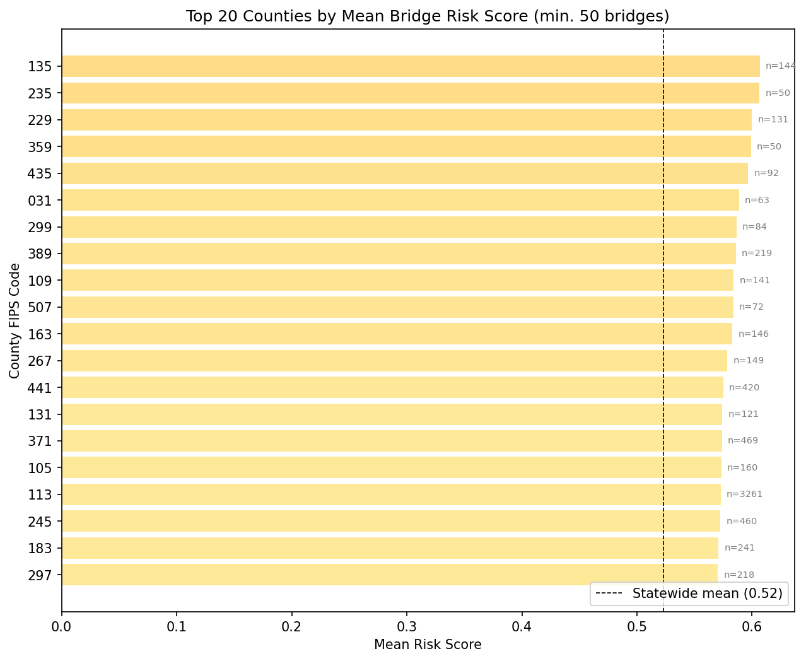

# Claude Code Workshop: Bridge Risk Assessment

A hands-on workshop demonstrating AI-assisted data analysis using [Claude Code](https://claude.ai/code). Participants build a complete structural risk assessment pipeline for 56,951 Texas bridges using the FHWA National Bridge Inventory, progressing from raw federal data to interactive visualisation in a single session.

**Audience:** Civil and structural engineering students and academics.



---

## What This Workshop Covers

1. **Data acquisition** -- downloading and cleaning real infrastructure data from the FHWA National Bridge Inventory
2. **Risk modelling** -- computing a composite structural risk score from condition ratings, bridge age, and traffic exposure
3. **Visualisation** -- generating publication-quality figures and an interactive map explorer
4. **Communication** -- producing conference and lecture presentations programmatically

Every step is performed collaboratively with Claude Code, showing how an AI coding assistant accelerates data analysis workflows.

## Risk Score Formula

```
risk_score = w_condition * condition_risk + w_age * age_risk + w_traffic * traffic_risk
```

| Component | Formula | Rationale |
|-----------|---------|-----------|
| Condition risk | `(9 - min_rating) / 9` | Inverts the NBI 0-9 scale; worst condition = highest risk |
| Age risk | `min(age / 50, 1.0)` | Normalised against 50-year design life, capped at 1.0 |
| Traffic risk | `log1p(ADT) / log1p(max_ADT)` | Log-compressed to handle 5 orders of magnitude (0 to 810k) |

---

## Repository Structure

```
.
|-- README.md                          # This file
|-- INSTALL_README.md                  # Claude Code installation guide
|
|-- bridge_risk_demo/
|   |-- bridges_texas.csv              # NBI 2025 Texas data (56,951 records, 23 MB)
|   |-- texas_boundary.geojson         # Texas state boundary for mapping
|   |-- bridge_analysis.py             # Main analysis: load, score, summarise, plot
|   |-- create_presentation.py         # Conference presentation generator (10 slides)
|   |-- outputs/
|       |-- data_description.md        # Dataset documentation
|       |-- plan.md                    # Implementation plan
|       |-- results_description.md     # Key findings and figure interpretations
|       |-- fig1_risk_map.png          # Geographic risk map with metro insets
|       |-- fig2_age_condition.png     # Age vs condition scatter plot
|       |-- fig3_risk_distribution.png # Risk score histogram with tier bands
|       |-- fig4_county_risk.png       # Top 20 counties bar chart
|       |-- presentation.pptx         # 10-slide conference presentation
|
|-- lecture_materials/
    |-- generate_lecture_pptx.py       # Lecture presentation generator (17 slides)
    |-- export_bridge_data.py          # Export bridge data to compact JSON
    |-- generate_html.py              # Interactive explorer generator
    |-- lecture_bridge_risk.pptx       # 17-slide teaching presentation
    |-- bridge_data.json               # Compact bridge data for the explorer
    |-- bridge_risk_explorer.html      # Interactive map app (self-contained)
```

---

## Quick Start

### Prerequisites

- Python 3.9+ with `pandas`, `numpy`, `matplotlib`, `geopandas`, `python-pptx`
- Claude Code ([installation guide](INSTALL_README.md))

All dependencies ship with Anaconda. For a minimal install:

```bash
pip install pandas numpy matplotlib geopandas python-pptx
```

### 1. Download the data

The NBI data file (`bridges_texas.csv`, 23 MB) is included in the repository. It was downloaded from the [FHWA NBI ASCII data page](https://www.fhwa.dot.gov/bridge/nbi/ascii2025.cfm) (2025 Texas file, comma-delimited).

### 2. Run the analysis

```bash
python bridge_risk_demo/bridge_analysis.py
```

This produces:
- A terminal summary (risk statistics, tier counts, top-5 highest-risk bridges)
- Four figures saved to `bridge_risk_demo/outputs/`

### 3. Generate lecture materials

```bash
python lecture_materials/export_bridge_data.py
python lecture_materials/generate_lecture_pptx.py
python lecture_materials/generate_html.py
```

### 4. Explore interactively

Open `lecture_materials/bridge_risk_explorer.html` in a web browser. No server required -- all data is embedded in the HTML file.

---

## Key Findings

| Metric | Value |
|--------|-------|
| Total bridges analysed | 56,951 |
| Mean risk score | 0.52 |
| Median risk score | 0.55 |
| High or Critical tier | 61.9% |
| FHWA Poor condition (rating &le; 4) | 1.2% |
| Exceeding 50-year design life | 43.8% |
| Poor bridges with ADT > 50,000 | 18 |

The central finding: **condition ratings alone identify 1.2% of bridges as concerning, but the composite score flags 61.9%** when age and traffic exposure are included. This gap represents latent risk -- structures that are acceptable today but aging beyond their design life under heavy traffic.

---

## Interactive Explorer

The `bridge_risk_explorer.html` app lets you:

- **Adjust risk weights** with sliders (condition, age, traffic)
- **Filter by tier** (Low, Moderate, High, Critical)
- **See live statistics** update as you change parameters
- **Explore the map** with tooltips showing each bridge's component risks

### Workshop Tasks

| Task | Weights (C / A / T) | What to observe |
|------|---------------------|-----------------|
| 1. Default | 30 / 30 / 40 | Baseline: ~35k High bridges, ~310 Critical |
| 2. Condition-heavy | 80 / 10 / 10 | Critical count drops; condition data alone is sparse |
| 3. No traffic | 60 / 40 / 0 | Urban interstates lose priority; rural bridges rise |

---

## Output Gallery

### Risk Map
Geographic distribution with metro insets for Dallas-Fort Worth, Houston, and San Antonio-Austin.


### Age vs. Condition
Shows that age does not strongly predict condition -- 43.8% of bridges exceed design life but most maintain satisfactory ratings.



### Risk Distribution
Distribution peaking in the High tier. Mean (0.52) trails median (0.55).



### County Risk
Top 20 counties by mean risk score. All are rural; urban counties have lower mean risk despite more total bridges.



---

## Data Source

**FHWA National Bridge Inventory, 2025 release**
- Download: [fhwa.dot.gov/bridge/nbi/ascii2025.cfm](https://www.fhwa.dot.gov/bridge/nbi/ascii2025.cfm)
- Format documentation: [fhwa.dot.gov/bridge/nbi/format.cfm](https://www.fhwa.dot.gov/bridge/nbi/format.cfm)
- State: Texas (code 48), 56,951 highway bridge records, 123 columns
- Licence: U.S. Government public domain

---

## How This Was Built

This entire project -- data download, analysis code, figures, presentations, interactive app, and this README -- was built in a single Claude Code session. The conversation progressed through:

1. Choosing a dataset (NBI) and downloading Texas bridge data
2. Writing a data description document
3. Creating an implementation plan
4. Implementing `bridge_analysis.py` with risk scoring and four figures
5. Writing results interpretation
6. Enhancing the risk map with state boundary, cities, and metro insets
7. Generating a 10-slide conference presentation
8. Building lecture materials: 17-slide deck, data export, and interactive HTML explorer

No code was written manually. Every file was authored, debugged, and iterated through natural language conversation with Claude Code.

---

## References

- ASCE. (2021). *2021 Report Card for America's Infrastructure*. American Society of Civil Engineers.
- FHWA. (2025). National Bridge Inventory ASCII Data. Federal Highway Administration.
- Bolukbasi, M., Mohammadi, J., & Arditi, D. (2004). Estimating the future condition of highway bridge components. *Journal of Infrastructure Systems*, 10(3), 118-125.
- Chase, S. B., Adu-Gyamfi, Y., Aktan, A. E., & Minaie, E. (2016). *Synthesis of National and International Methodologies Used for Bridge Health Indices*. FHWA Report No. FHWA-HRT-15-081.

---

## Licence

Workshop materials are provided for educational use. The NBI dataset is U.S. Government public domain. Code is MIT licensed.
